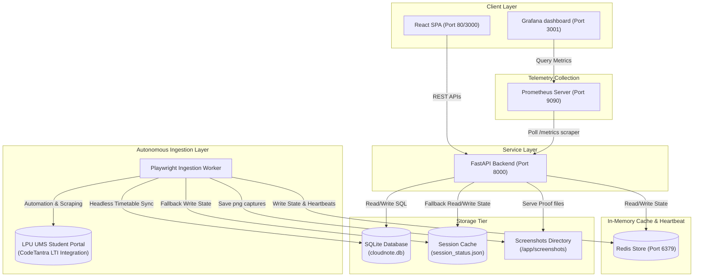
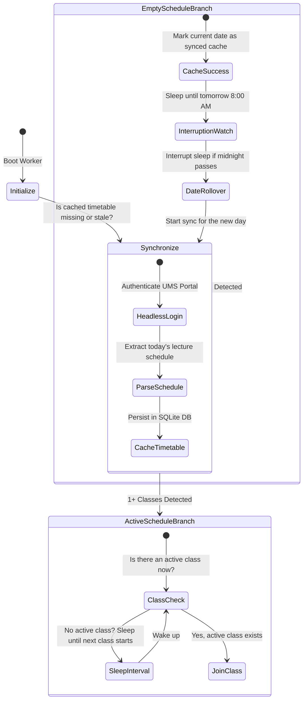
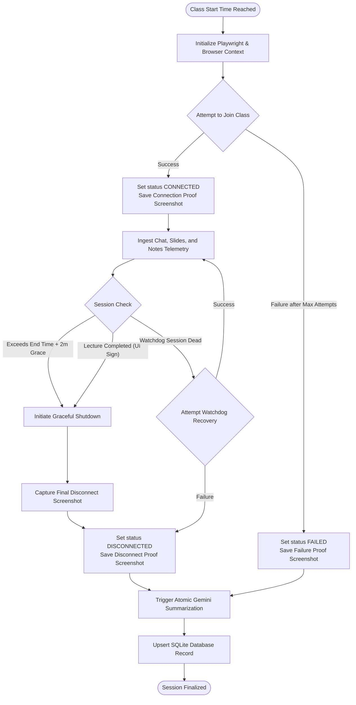
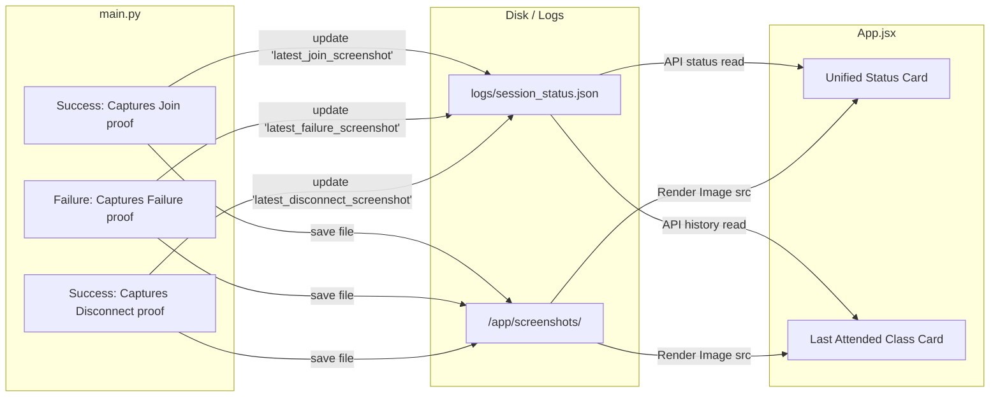
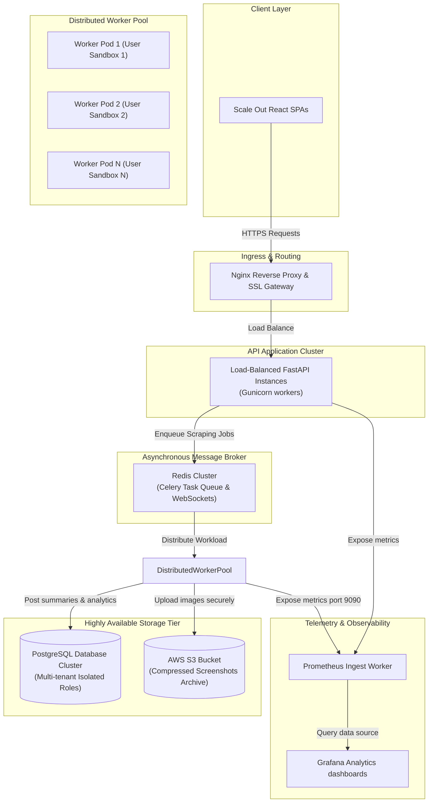

# CloudNote Architectural Design Specification

This document provides a highly detailed engineering overview of the CloudNote autonomous lecture joining and attendance proof validation stack. It maps out our current stable MVP architecture, the scheduler state machine, the screenshot validation pipeline, and lays out a production-ready future scaling roadmap.

---

## 1. High-Level Core System Architecture

The following diagram illustrates the interaction between the decoupled microservice layers and the live production sidecar integrations:
- **Client Layer**: Single Page Application built with React (served via Nginx) alongside the pre-built **Grafana Operational Dashboard** rendering active performance metrics.
- **Service Layer**: REST Web API backend powered by FastAPI, responsible for serving cache details, database records, and exporting the Prometheus `/metrics` scrape endpoint.
- **In-Memory Cache & Heartbeat Layer**: Optional Redis container holding ephemeral state caches, active connection telemetry, and periodic scheduler heartbeats.
- **Storage Tier**: Persistent SQLite3 database and JSON state files which serve as a bulletproof local fallback if Redis is offline.
- **Autonomous Ingestion Layer**: Playwright-based background scheduler worker managing CodeTantra student portal logins, countdown checks, and class join automated actions.
- **Telemetry Collection Layer**: Prometheus monitoring daemon pulling scrape records from the backend and provisioning Grafana panels.

---

## 2. Scheduler & Rollover State Machine

The scheduler worker executes as a continuous daemon or via scheduled triggers (such as Cron or Systemd). It maintains extreme stability on days with no scheduled classes (like Sundays) and handles date rollovers gracefully without redundant CPU spin:

---

## 3. Attendance Ingestion & Monitoring Lifecycle

Once an active class is detected, the Playwright automation browser goes through a robust lifecycle: attempting to join, capturing visual proofs, actively logging telemetry, recovering connection errors via a watchdog, and initiating graceful shutdown:

---

## 4. Mutually Exclusive Screenshot Persistence Mapping

Visual proof of attendance is categorized by session outcome. To prevent rendering contradictory images (such as displaying both successful join and failure screens simultaneously), the UI maps state files strictly according to this schema:

---

## 5. Production-Ready Future Scalability Architecture

To migrate CloudNote from a single-student local MVP to a high-capacity, multi-tenant SaaS application supporting thousands of concurrent automated sessions, we propose the following horizontally scalable cloud-native design:

### Future Scalability Detail Specs:
1. **Asynchronous Redis Queues**: Integrates Redis as a broker. The API scheduler publishes scheduled join events to the Celery queue instead of self-spawning Playwright workers inside the VM.
2. **Worker Isolation**: Each student's Playwright worker executes inside a sandboxed, isolated, lightweight container (e.g. dynamic Kubernetes Pod) to prevent cookie contamination, resource starvation, or cross-student privilege escalation.
3. **Observability Stack**: Prometheus scrapes state metrics from all active containers while Grafana acts as the operational nerve center, alerting administrators of network anomalies, OCR failures, or student login failures.
4. **Reliable Storage**: Replaces SQLite with a robust, highly available multi-tenant PostgreSQL system and stores screenshot blobs securely inside object storage (such as AWS S3 or Google Cloud Storage) behind expiring signed URLs.
