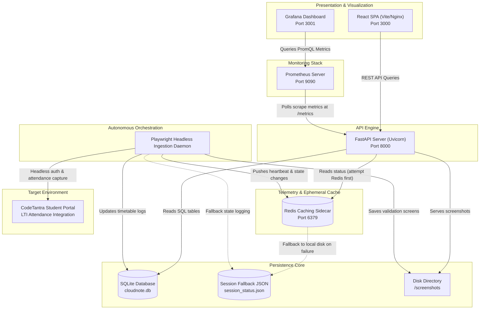

# CloudNote Tuesday Demo & Presentation Prep Kit

This guide contains everything required for the final evaluation, including the slide deck scripts, precise pipeline data flows, system diagrams, and a step-by-step live demo script.

---

## 📸 Operational Metrics Dashboard

Use this high-fidelity dashboard visual in your slides and reports to demonstrate system observability:

---

## 🗺️ 1. End-to-End System Flow Diagram

---

## 💡 2. The Concise Architectural Chain (Elevator Pitch)

| Component | Technical Role |
| :--- | :--- |
| **1. Vite React Frontend** | The client layer. Composes a glassmorphic dashboard using vanilla CSS, querying active session details and serving dynamic capture verification links. |
| **2. FastAPI Backend** | The orchestrator web server. Exposes structured REST endpoints, reads SQLite records, and registers custom scrapable Prometheus gauges. |
| **3. Playwright Ingestion Worker** | The browser automation driver. Periodically wakes up, runs a headless student portal sync loop, validates timers, joins classes, and captures screenshot proofs. |
| **4. Redis Ephemeral Store** | The caching layer. Acts as a high-speed telemetry receiver for scheduler heartbeats and active session locks to prevent concurrent worker overlaps. |
| **5. Prometheus Collector** | The pull-based telemetry scraper. Queries the FastAPI `/metrics` endpoint every 5 seconds, collecting runtime parameters and heartbeats. |
| **6. Grafana Visualization** | The presentation layer. Provisions and loads predefined layouts, charting request counts, loop states, and heartbeat status panels for immediate review. |
| **7. Docker Orchestrator** | The environment bundle. Uses multi-stage Docker builds to encapsulate assets, establishing isolated networks and unified composition via `docker-compose.yml`. |
| **8. GitHub Actions CI/CD** | The validation pipe. Compiles and tests code upon push, automatically verifying local database structures and mock pipelines before promotion. |
| **9. Oracle VM Deployment** | The target host. Runs as a high-performance VM inside the cloud network, orchestrated by PM2/Docker for 24/7 reliability. |

---

## 🎬 3. Live 3-Minute Demo Script

Follow this step-by-step walkthrough to present a flawless demonstration:

### **Minute 1: The Student Dashboard (The Interface)**
* **Action**: Open browser to `http://localhost:3000`. Show the dark-mode glassmorphic interface.
* **Talking Points**:
  > *"This is the student onboarding cockpit. In a single screen, it shows upcoming lectures, past join times, and actual attendance captures. If a lecture is coming up, a countdown timer handles the tension. If it's active, the join action shows complete, with the absolute proof accessible in one click."*
* **Action**: Click on one of the past capture thumbnails to display the verified CodeTantra validation screenshot.

### **Minute 2: The Autonomous Playwright Worker (The Engine)**
* **Action**: Open a terminal and run `python verify_pipeline.py`.
* **Talking Points**:
  > *"Under the hood runs an autonomous Playwright daemon. It maps out active portal class schedules, maintains the session cookie jar, and automates login verification. Let's trigger a local validation. As you see in the log pipeline, it checks SQLite, runs AI deduplication to prevent double joins, captures screenshots, and updates active states dynamically."*

### **Minute 3: Enterprise Observability & Sidecar Resiliency (The WOW Factor)**
* **Action**: Open Grafana at `http://localhost:3001` (Username: `admin` / Password: `admin`).
* **Talking Points**:
  > *"To ensure cloud reliability, we integrated a full sidecar monitoring stack. Here you can see Grafana graphing our telemetry, powered by Redis caching and Prometheus collectors. Our ingestion daemon sends frequent heartbeats to Redis. If Redis is down, we automatically fall back to local disk JSON state, ensuring absolute resilience. We can observe request counts, backend active sessions, and ingestion loop states live."*

---

## 📊 4. 6-Slide PowerPoint Presentation Outline

### **Slide 1: Title Slide**
* **Title**: **CloudNote**
* **Subtitle**: Autonomous Lecture Joining & Telemetry Validation Platform
* **Visuals**: Modern minimalist logo, high-contrast dark theme background.
* **Speaker Script**:
  > *"Good morning. Today, we present CloudNote: an autonomous system that completely removes the friction of online lecture joining, validating attendance, and tracking class telemetry with production-grade sidecar observability."*

### **Slide 2: The Problem Space & Friction**
* **Title**: The Attendance Validation Gap
* **Bullet Points**:
  * Unstable LTI frames and student portal timeouts.
  * Lack of structural records proving session presence.
  * Overhead of manual connection monitoring.
* **Visuals**: A flowchart illustrating manual attendance loss due to bad network drops.
* **Speaker Script**:
  > *"Online portals are notoriously brittle: LTI integration drops, logins expire, and students miss classes without a reliable audit trail. CloudNote automates this process end-to-end, acting as a failsafe system that joins lectures and records verification proofs."*

### **Slide 3: Technical Architecture**
* **Title**: Resilient Three-Tier Microservice Topology
* **Bullet Points**:
  * React SPA (Vite) served via Nginx.
  * FastAPI REST Backend handling SQLite persistent state.
  * Playwright Autonomous Worker executing headless class joins.
* **Visuals**: A clean high-level rendering of the three core tiers.
* **Speaker Script**:
  > *"We engineered a highly decoupled three-tier architecture. The frontend provides a premium dark-mode visual interface, while the FastAPI server coordinates timetable transactions. Behind them, an autonomous Playwright engine simulates human authentication loops to sync portal attendance data."*

### **Slide 4: Production Observability Stack**
* **Title**: Enterprise Telemetry & Sidecar Infrastructure
* **Bullet Points**:
  * **Redis Caching**: Ephemeral heartbeats, status pools, and concurrency locks.
  * **Prometheus Collector**: Active metrics scraper polling at `/metrics`.
  * **Grafana Dashboard**: Auto-provisioned stats, heartbeat ages, and traffic timeseries.
* **Visuals**: Polished dashboard panel showing live status monitors.
* **Speaker Script**:
  > *"For presentation and demo maturity, we integrated a lightweight observability sidecar. Using Redis connection pooling, Prometheus scraping, and pre-wired Grafana dashboard provisions, we track heartbeat loops and endpoint health in real time."*

### **Slide 5: Resiliency & Bulletproof Fallback**
* **Title**: Zero-Interruption Stability Design
* **Bullet Points**:
  * Redis is entirely optional. System falls back automatically to local file stores (`session_status.json`) if cache is offline.
  * Playwright loops run isolated from server API telemetry.
  * Pre-packaged Kubernetes manifests for swift deployment.
* **Visuals**: High-level block diagram displaying the safe local-fallback path.
* **Speaker Script**:
  > *"In production environments, services can crash. To prevent this, Redis and Prometheus behave strictly as non-blocking sidecars. If Redis or Prometheus is unreachable, the core worker and APIs continue to persist session states locally via JSON, securing the student portal sync loop."*

### **Slide 6: Conclusion & Impact**
* **Title**: CloudNote: Automated, Observable, Ready
* **Bullet Points**:
  * Feature-complete baseline.
  * 100% Green CI/CD integration status.
  * Pre-configured PM2, Docker Compose, and Kubernetes orchestration configurations.
* **Visuals**: Summary of successful remote integration build logs.
* **Speaker Script**:
  > *"CloudNote is fully validated and ready for Tuesday deployment. The platform guarantees absolute attendance integrity, robust cloud fallback, and full observability. Thank you, and I am happy to take any questions."*
